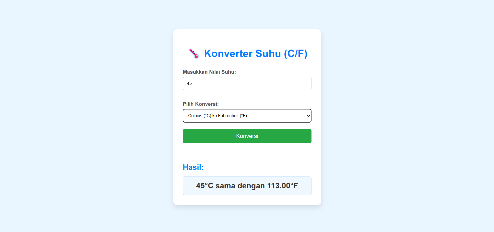

# Konverter-Suhu AI

Konversi Dua Arah: Mendukung konversi antara Celcius (°C) dan Fahrenheit (°F).
Perhitungan Akurat: Menggunakan rumus matematika yang tepat untuk konversi suhu.
Validasi Input: Menangani input non-angka dengan pesan kesalahan yang jelas, memastikan pengalaman pengguna yang mulus.
UX Responsif: Hasil konversi ditampilkan secara real-time saat pengguna mengubah nilai input atau tipe konversi.

